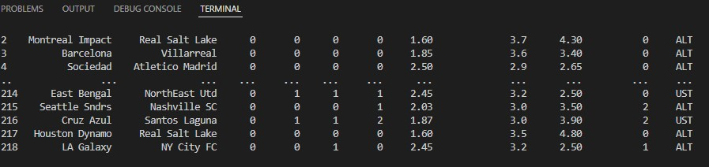

## PYTHON İLE WEB KAZIMA

- BİR WEBSİTESİ ÜZERİNDEN GEÇMİŞ 13 SAYFAYA KADAR TAKIMLARIN BİLGİLERİ ÇEKİLDİ.
- BU BİLGİLER: MAÇ SONUÇLARI, ORANLAR, GOL MİKTARLARI VB.
- VERİLER ÇEKİLİRKEN BeautifulSoup modülü kullanıldı.
- ÇEKİLEN VERİLER PANDAS KÜTÜPHANESİ ARACILIĞIYLA DATAFRAME'E DÖNÜŞTÜRÜLDÜ.
- VE BU DATAFRAME BİR EXCEL(.csv) DOSYASINA DÖNÜŞTÜRÜLDÜ.
- MAKİNE ÖĞRENMESİ ALGORİTMALARININ DENENEBİLMESİ İÇİN VERİLER HAZIR HALE GETİRİLDİ.

